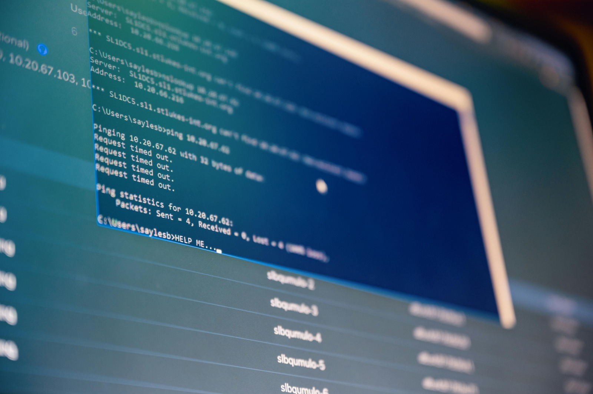

# Portofolio Organisasi IT 🌐

Selamat datang di Proyek Portofolio Organisasi IT! Proyek ini dirancang untuk menampilkan kemampuan, kegiatan, dan pencapaian organisasi IT kami melalui website yang responsif dan interaktif.

## 📌 Gambaran Umum
Portofolio ini dibuat menggunakan **HTML**, **CSS**, dan **JavaScript** untuk menghadirkan tampilan menarik yang dapat dinikmati pengguna. Di dalamnya, kami menyajikan berbagai aspek organisasi, termasuk misi, layanan, proyek, dan tim kami.

## 🚀 Fitur
- **Desain Responsif**: Tampilan yang menyesuaikan dengan baik di berbagai perangkat, dari desktop hingga ponsel.
- **UI/UX Modern**: Antarmuka yang bersih dan mudah digunakan, dilengkapi animasi CSS yang menarik.
- **Konten Dinamis**: Interaktivitas yang ditingkatkan dengan JavaScript untuk pengalaman pengguna yang lebih baik.
- **Navigasi Lancar**: Struktur tata letak yang mudah diakses.
- **Kompatibilitas Lintas-Browser**: Dapat diakses dengan baik di Chrome, Firefox, Edge, dan Safari.

## 📂 Struktur Proyek
File dan folder utama dalam proyek ini meliputi:
- `index.html`: Halaman utama website.
- `style.css`: Mengandung seluruh gaya untuk meningkatkan tampilan visual.
- `script.js`: Menambah interaktivitas, seperti animasi dan penanganan event.
- `uploads/`: Folder untuk gambar, ikon, dan aset lainnya.

## 📸 Tangkapan Layar

*Gambar dari halaman utama.*


*Contoh bagian proyek kami.*

## 💻 Instalasi & Penggunaan
1. **Clone repository**:
   ```bash
   git clone https://github.com/eKyyTRY/Portofolio-Organisasi-IT.git

2. **Masuk ke direktori proyek**:
   ```bash
   cd Portofolio-Organisasi-IT
   
3. **Buka** index.html di **browser** untuk melihat website secara lokal.

## 🌐 Demo
Lihat demo langsung di [sini](https://portofolio-organisasi-it.netlify.app/) 

✨ Kontribusi
Kami terbuka untuk kontribusi! Fork repository ini, lakukan perubahan, dan buat pull request.
